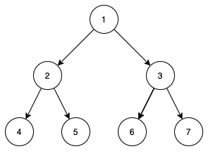

# Heap

# 简介

本次课设我实现的数据结构是**堆（heap)**，堆是一种非常重要的数据结构，分为大顶堆和小顶堆，可以快速地获取其中优先级最高的元素。若是满足以下特性，即可称为堆：“给定堆中任意节点P和C，若P是C的母节点，那么P的值会小于等于（或大于等于）C的值”。若母节点的值恒小于等于子节点的值，此堆称为最小堆（min heap）；反之，若母节点的值恒大于等于子节点的值，此堆称为最大堆（max heap）。所以堆又称作优先队列。

# 原理

## 完全二叉树

堆的实现方式通常是完全二叉树，采用数组进行模拟。完全二叉树的特点是较为对称，查找时时间复杂度较为稳定，可以通过数组进行模拟，而不需要实际构建一棵二叉树。

以数组 `[1, 2, 3, 4, 5, 6, 7]` 为例，可以构建出如下一棵完全二叉树。



对于每个节点都满足值大于父节点，所以这是一个小顶堆。对比数组和二叉树，可以发现：

1. 对于节点 `i` ，它的两个子节点在数组中的索引为 `2*i` 和 `2*i+1`
2. 两个子节点的大小对于堆的性质并没有影响，这点和二叉搜索树不一样

其中的核心操作是 `shiftUp` 和 `shiftDown` 

分析其时间复杂度，有：

- 获取堆顶元素：$O(1)$
- 插入元素：$O(logn)$
- 删除元素：$O(logn)$
- 合并堆：$O(n)$

不过采用完全二叉树并不能方便地进行合并操作，需要转换成对一个堆的插入操作

---

但在函数式语言中要如何实现一个堆呢？对于纯函数式语言，是不允许有副作用的。虽然 `Ocaml` 支持命令式操作，也支持传统的数组，但依然采用数组模拟的话和普通的命令式语言就没有太多区别，而且会产生副作用，这是不推荐的。那么如果用 `List` 来模拟数组操作呢？

`Ocaml` 中的 `List` 是通过链表实现的，这就意味着 `List` 只能进行顺序访问，无法随机访问，也就无法像上面那样构建出一个虚拟的树形结构，而要全部转换成遍历操作。虽然可以通过计算和记录确定节点的位置，但会导致访问的时间复杂性大大提高。还有别的办法吗？

既然用数组模拟完全二叉树的方法在函数式语言中有很大的限制，那我们手动模拟一棵二叉树试试。我们可以定义出以下的数据结构：

```ocaml
type 'a heap = 
	| Leaf
	| Node of 'a * 'a heap * 'a heap
```

该结构参考了书上的内容，一个节点由自身的值和左右子节点构成，空节点为叶子节点。

对于插入操作，传统的数组模拟方式将元素插入数组尾部，再调用 `shiftUp` 操作将元素移动到正确的位置，如图所示：


但在树状结构中，我们很难找到最后一个元素的位置，或者说时间复杂度太高，不具备可行性，也就无法采用 `shiftUp` 的思想。而我们的树结构只保存了根节点的位置，也就意味着只能自顶向下想想办法。


首先比较 1 和 4 ，1 比 4 小，应该继续向下，但应该走左边还是右边呢？堆能保持高效性的原因之一就是结构比较对称，即左右子树的深度大致相等。必须要找到一个规则来解决这个问题。

堆的另一个重要操作是删除，即删除最顶端节点。这时我们发现如果删掉了根节点，我们会得到两个二叉树：


在数组模拟的方式中我们将数组的最后一个元素（也就是完全二叉树的最后一个节点）移动到原本根节点的为止，再采用 `shiftDown` 操作将它移动到正确的位置。但同上面的问题一样，无法快速定位到最后一个节点，因此问题变成了如何合并两个堆。这时再看插入操作，发现也可以当成合并堆解决，即将目标堆和由待插入元素构成的只有一个节点的堆进行合并。可见堆的核心操作都转换成了堆合并，这就需要找到一个可以高效地进行堆合并的方法。

## 左偏树

搜索后发现，虽然大部分算法教程和书中堆都是采用数组模拟完全二叉树，但也有其它数据结构可以实现堆，就是左偏树。查看维基百科中的定义：

> 左偏树是一种可并堆的实现。左偏树是一棵二叉树，它的节点除了和二叉树的节点一样具有左右子树指针（left, right）外，还有两个属性： 键值和距离（英文文献中称为s-value）。键值用于比较节点的大小。距离的定义如下：
当且仅当节点 i 的左子树或右子树为空时，节点被称作外节点（实际上保存在二叉树中的节点都是内节点，外节点是逻辑上存在而无需保存。把一颗二叉树补上全部的外节点，则称为extended binary tree）。节点i的距离是节点 i 到它的后代中的最近的外节点所经过的边数。特别的，如果节点 i 本身是外节点，则它的距离为0;而空节点的距离规定为 -1。

光看定义比较复杂，但其实很简单，只需要在上面定义的树中加入一个距离（rank）即可，一个节点距离的值为到最右叶子节点的长度，如图所示：


rank 是用来比较左右子树的长度的，在左偏树中，**所有节点的左子树 rank 值一定大于等于右子树**。因此每次进行合并操作时我们选择右子树，重复进行直到叶子节点或正确的位置，最后更新路径上的 rank 值，如果出现右子树的 rank 值大于左子树，则交换左右子树以保证左偏树的定义成立。

作为左偏树的核心操作，合并（merge）操作的流程如下：

1. 合并 `t1` ，`t2` 两个树 `merge t1 t2`
2. 比较两个树根节点的值，如果 `v1 < v2` 则交换两个树（即 `merge t2 t1` ），这样做的目的是保证左边树的值小于右边，便于操作。实际比较操作是通过函子中的 `compare` 函数进行，可以根据该函数设置大顶堆或小顶堆
3. 由于左边树（ `t1` ）根节点的值小于右边树（ `t2` ），`v1` 保持不变作为新的根节点
4. 由于 `t1` 的右子树 `r` 一定是最短的，开始合并 `r` 和 `t2` （即 `merge r t2` ）
5. 当任一子树是叶子节点时，只需要直接返回另一个子树，并开始向上更新每个节点的 `rank` 值
6. 更新完毕后还要比较左右子树的 `rank` 值以确定是否需要交换左右子树

看一个合并子树的例子：


分析其时间复杂度，有：

- 获取堆顶元素：$O(1)$
- 插入元素：$O(logn)$
- 删除元素：$O(logn)$
- 合并堆：$O(logn)$

# 代码

## 完全二叉树

这部分代码是我一开始研究学习时写的测试代码，比较混乱，也采用了很多命令式语言的思维，比如有大量的副作用，对对象的操作都是在一个对象本身等。这里保留在这来和下面纯函数式的写法做一个对比

`binary_heap.ml`

```ocaml
(* Input signature of the functor *)
module type OrderedType = sig
  (* the type of the heap elements *)
  type t

  (* compare function used to determine the order of elements *)
  val compare : t -> t -> int
end

module Make (Ord : OrderedType) = struct
  type elt = Ord.t

  type tree = { mutable elements : elt array; mutable size : int }

  let create n default = { size = 0; elements = Array.make n default }

  let insert v t =
    let d = t.elements in
    let rec shiftUp i =
      let fi = (i - 1) / 2 in
      if i > 0 && Ord.compare d.(fi) v > 0 then (
        d.(i) <- d.(fi);
        shiftUp fi )
      else d.(i) <- v
    in
    shiftUp t.size;
    t.size <- t.size + 1

  let deleteTop t =
    if t.size <= 0 then failwith "empty"
    else
      let n = t.size - 1 in
      t.size <- n;
      let d = t.elements in
      let x = d.(n) in
      let rec shiftDown i =
        let ci = (2 * i) + 1 in
        if ci < n then
          let j =
            let k = ci + 1 in
            if k < n && Ord.compare d.(k) d.(ci) < 0 then k else ci
          in
          if Ord.compare d.(j) x < 0 then (
            d.(i) <- d.(j);
            shiftDown j )
          else d.(i) <- x
        else d.(i) <- x
      in
      shiftDown 0

  let getTop t = if t.size <= 0 then failwith "empty" else t.elements.(0)

  let rec toList t =
    if t.size <= 0 then []
    else
      let top = getTop t in
      deleteTop t;
      top :: toList t

  let rec fromList n default = function
    | [] -> create n default
    | hd :: tl ->
        let t = fromList n default tl in
        insert hd t;
        t
end
```

`binary_heap.mli`

```ocaml
(* Input signature of the functor *)
module type OrderedType = sig
  (* the type of the heap elements *)
  type t

  (* compare function used to determine the order of elements *)
  val compare : t -> t -> int
end

module Make : functor (Ord : OrderedType) -> sig
  type elt = Ord.t

  type tree

  (* create an empty heap, with only a leaf *)
  val create : int -> elt -> tree

  (* insert an element into a heap, just like merge two heap *)
  val insert : elt -> tree -> unit

  (* delete the top element of a heap, just merge two children trees *)
  val deleteTop : tree -> unit

  (* get the top element of a heap *)
  val getTop : tree -> elt

  (* generate a list from a heap *)
  val toList : tree -> elt list

  (* create a heap from list *)
  val fromList : int -> elt -> elt list -> tree
end
```

## 左偏堆

这里的左偏堆采用了纯函数式的写法，包括采用联合体构建一棵二叉树，所有操作都无副作用，返回一个新的对象等。和上面命令式的写法相比，也更加简练，通过递归和迭代就实现了复杂的操作逻辑

`heap.ml`

```ocaml
(* Input signature of the functor *)
module type OrderedType = sig
  (* the type of the heap elements *)
  type t

  (* compare function used to determine the order of elements *)
  val compare : t -> t -> int
end

module Make (Ord : OrderedType) = struct
  type elt = Ord.t

  (* heaps are represented by leftist tree *)
  type tree =
    (* leaf node *)
    | Leaf
    (* left child, value of node, right child, rank of node *)
    | Node of tree * elt * tree * int

  (* create an empty heap, with only a leaf *)
  let create () = Leaf

  (* create a node contains only v *)
  let singleton v = Node (Leaf, v, Leaf, 1)

  (* get the rank of a node *)
  let getRank = function Leaf -> 0 | Node (_, _, _, r) -> r

  (* merge to heap, the most important function in leftist heap *)
  let rec merge t1 t2 =
    match (t1, t2) with
    | Leaf, t | t, Leaf -> t
    | Node (l, v1, r, _), Node (_, v2, _, _) ->
        (* switch two heap if the tree on the left have a bigger key *)
        if Ord.compare v1 v2 > 0 then merge t2 t1
          (* the order is determined by the compare function *)
        else
          (* merge with the right tree *)
          let merged = merge r t2 in
          let leftRank = getRank l and rightRank = getRank merged in
          (* compare the rank of both tree *)
          if leftRank >= rightRank then Node (l, v1, merged, rightRank + 1)
            (* switch left and right since left tree is shorter *)
          else Node (merged, v1, l, leftRank + 1)

  (* insert an element into a heap, just like merge two heap *)
  let insert v t =
    match t with
    | Leaf -> singleton v
    | Node (_, _, _, _) -> merge t (singleton v)

  (* get the top element of a heap *)
  let getTop = function Leaf -> failwith "empty" | Node (_, v, _, _) -> v

  (* delete the top element of a heap, just merge two children trees *)
  let deleteTop = function
    | Leaf -> failwith "empty"
    | Node (l, _, r, _) -> merge l r

  (* generate a list from a heap *)
  let rec toList t =
    match t with Leaf -> [] | _ -> getTop t :: toList (deleteTop t)

  let rec fromList = function
    | [] -> create ()
    | hd :: tl -> insert hd (fromList tl)
end
```

`heap.mli`

```ocaml
(* Input signature of the functor *)
module type OrderedType = sig
  (* the type of the heap elements *)
  type t

  (* compare function used to determine the order of elements *)
  val compare : t -> t -> int
end

module Make : functor (Ord : OrderedType) -> sig
  type elt = Ord.t

  type tree

  (* create an empty heap, with only a leaf *)
  val create : unit -> tree

  (* merge to heap, the most important function in leftist heap *)
  val merge : tree -> tree -> tree

  (* insert an element into a heap, just like merge two heap *)
  val insert : elt -> tree -> tree

  (* get the top element of a heap *)
  val getTop : tree -> elt

  (* delete the top element of a heap, just merge two children trees *)
  val deleteTop : tree -> tree

  (* generate a list from a heap *)
  val toList : tree -> elt list

  (* create a heap from list *)
  val fromList : elt list -> tree
end
```

`test.ml`

测试文件，对所写的堆向外提供的函数进行测试。创建了一个带 `int` 类型的函子，采用自定义的排序函数实现大顶堆。还创建了一个 `String` 类型的函子

```ocaml
(* int 型函子，带比较函数 *)
module E = struct
  type t = int

  let compare a b = -compare a b
end

(* int 型大顶堆，采用左偏树 *)
module H_int = Heap.Make (E)

let t = H_int.create ()

(* 测试基本的插入、删除等操作 *)
let () =
  let t =
    H_int.insert 3 t |> H_int.insert 5 |> H_int.insert 1 |> H_int.insert 4
    |> H_int.insert 2
  in
  assert (H_int.getTop t = 5);
  assert (H_int.deleteTop t |> H_int.deleteTop |> H_int.getTop = 3);
  List.iter (Printf.printf "%d ") (H_int.toList t);
  print_newline ()

(* 测试从 list 构建和生成 list *)
let () =
  let l = H_int.toList (H_int.fromList [ 4; 2; 1; 5; 6; 7; 2; 0 ]) in
  assert (l = [ 7; 6; 5; 4; 2; 2; 1; 0 ]);
  List.iter (Printf.printf "%d ") l;
  print_newline ()

(* 测试合并两个堆 *)
let () =
  let t =
    H_int.merge
      (H_int.fromList [ 1; 3; 5; 7; 9 ])
      (H_int.fromList [ 2; 4; 6; 8 ])
  in
  let l = H_int.toList t in
  assert (l = [ 9; 8; 7; 6; 5; 4; 3; 2; 1 ]);
  List.iter (Printf.printf "%d ") l;
  print_newline ()

(* string 型小顶堆 *)
module H_string = Heap.Make (String)

let t = H_string.create ()

(* 测试基本的插入、删除等操作 *)
let () =
  let t =
    H_string.insert "asdf" t |> H_string.insert "qwer" |> H_string.insert "zz"
  in
  assert (H_string.getTop t = "asdf");
  assert (
    H_string.toList
      (H_string.deleteTop t |> H_string.deleteTop |> H_string.insert "bb")
    = [ "bb"; "zz" ] )

(* 测试 string 类型上的操作 *)
let () =
  let l =
    H_string.toList
      (H_string.merge
         (H_string.fromList [ "Z"; "Y"; "X" ])
         (H_string.fromList [ "y"; "z"; "x" ]))
  in
  assert (l = [ "X"; "Y"; "Z"; "x"; "y"; "z" ]);
  List.iter (Printf.printf "%s ") l;
  print_newline ()

(* int 型大顶堆，采用数组模拟完全二叉树 *)
module B_H_int = Binary_heap.Make (E)

let t = B_H_int.create 20 0

(* 测试基本的插入、删除等操作 *)
let () =
  B_H_int.insert 1 t;
  B_H_int.insert 3 t;
  B_H_int.insert 2 t;
  B_H_int.insert 4 t;
  assert (B_H_int.getTop t = 4);
  B_H_int.deleteTop t;
  assert (B_H_int.getTop t = 3);
  B_H_int.deleteTop t;
  assert (B_H_int.getTop t = 2);
  B_H_int.insert 6 t;
  assert (B_H_int.getTop t = 6);
  B_H_int.deleteTop t;
  B_H_int.deleteTop t;
  assert (B_H_int.getTop t = 1)

let t = B_H_int.create 20 0

(* 测试生成 list *)
let () =
  B_H_int.insert 1 t;
  B_H_int.insert 3 t;
  B_H_int.insert 2 t;
  B_H_int.insert 4 t;
  List.iter (Printf.printf "%d ") (B_H_int.toList t);
  print_newline ()

(* 测试从 list 构建 *)
let () =
  let t = B_H_int.fromList 20 0 [ 1; 3; 5; 7; 9; 2; 4; 6; 8; 0 ] in
  assert (B_H_int.toList t = [ 9; 8; 7; 6; 5; 4; 3; 2; 1; 0 ])

(* 测试两种堆实现的结果一致 *)
let () =
  let t1 = H_int.fromList [ 1; 3; 5; 7; 9; 2; 4; 6; 8; 0 ]
  and t2 = B_H_int.fromList 20 0 [ 1; 3; 5; 7; 9; 2; 4; 6; 8; 0 ] in
  assert (H_int.toList t1 = B_H_int.toList t2)
```

项目采用 `make` 进行构建

```makefile
.PHONY:	all clean byte native profile debug test run

OCB_FLAGS = -tag bin_annot
OCB = 		ocamlbuild $(OCB_FLAGS)

all: native byte

clean:
	$(OCB) -clean

native:
	$(OCB) main.native

byte:
	$(OCB) main.byte

profile:
	$(OCB) -tag profile main.native

debug:
	$(OCB) -tag debug main.byte

run: native
	./main.native
```

# 心得体会

第一次用纯函数式语言写一个算法，和之前上课时在 `toplevel` 中测试还是有较大的区别，包括如何实现多文件编译，如何配置编译，如何编写模块等都困扰了我很久。最后依靠文档、手册、github上的一些项目等学会了如何构建一个 `Ocaml` 项目。

此外，`Ocaml` 标准库也给了我很大的帮助，里面的标准库如 `Set` 等都写得很清晰，有很详细的注释，我写的堆的模块结构、函子等都是参考 `Set` 库的处理方式。

对于函数式语言，特别是纯函数式的思想我也有了更深刻的理解。一开始我还是以命令式的思维来编写代码，认为不使用 `for` 、`while` 语句就是函数式，代码中还是存在很多 `mutable` 、`ref` 等内容，即存在副作用，也就导致了函数操作还是对一个“对象”进行操作，而不是每次返回一个新的结果。后来参考各种项目、教程，才发现了纯函数式“无副作用”的核心思想及处理方式。

我认为，纯函数式语言更贴近数学模型，可以用非常简练的语句写出算法，其核心是递归和迭代，例如我的堆通过短短几十行语句就实现了，通过一些精巧的递归就实现了命令式语言要写大量循环命令才能实现的功能。但这些简洁也带来了一些问题，比如代码抽象程度较高，理解起来较为困难；大量递归对栈上空间造成很大压力，性能降低了的同时也难以进行大量的计算，需要花费很大的力气去消除尾递归（但通常很难实现）；不允许副作用造成时间、空间的浪费；思维在两种思想中的转换较为困难等。但总的来说，函数式语言还是有很好的前景，从近年来越来越多的语言都开始支持函数式的写法（如 `lambda` 表达式等）可以看出。如 `C++` 、`Python` 、`Java` 等都有函数式的写法，我在平时编写代码的过程中也会用到函数式语句来简化代码。函数式语言和命令式语言在未来可能会越走越近，取长补短，最后融为一体。
